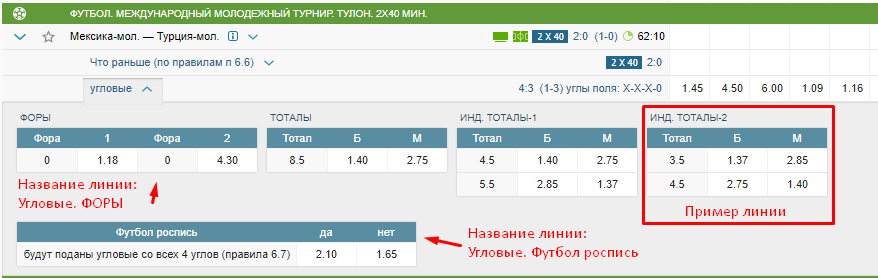
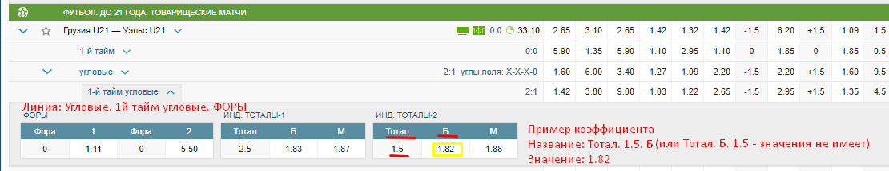
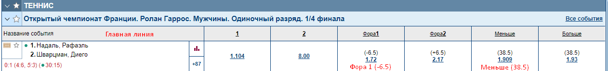
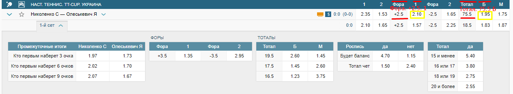

# Парсер букмекера

Задача: мы даём C# шаблон парсера, ссылку на букмекера, и вы пишете парсеры для двух его страниц, сверяясь с этой дорожной картой. Простенько, чётко и прокоментированно.

## Общая информация

Парсер должен быть написан на C#, внутри макета, который мы дадим.

В боевом режиме парсер будет работать как dll-класс букмекера, в который на вход будут подавать приходящие от нативного браузера запросы, поэтому начать надо с описания функции-роутера `Router`, которая должна отделить полезные запросы от бесполезных и направить каждый запрос на свою функцию парсинга.
Все парсеры должны возвращать в роутер единую структуру `Parsed`, которую он передаст в основной код.

Для тестов и как альтернатива в макете предусмотрена функция `Start()`, в которой можно делать запросы вручную и направлять их в роутер. Таким образом парсер становится обычным: в `Start` мы в бесконечном цикле делаем только нужные нам запросы, а Router их парсит и может подключиться к нативному браузеру, если ручная отправка запросов будет приводить к слишком частым банам.

Структура кода свободная, соблюдать надо только интерфейс, который уже реализован в макете со всеми нужными структурами. А так же важна прокоментированность кода, чтобы через год разобраться в этом парсере не составило бы труда.

#### Макет
В макете я постарался прописать желательные механики прямо в функциях.

Все свойства в main.cs, отмеченные звёздочкой, надо заполнить вручную. ID букмекера мы выдадим сразу перед работой, кодировки, используемые конкретным букмекером, надо изучить самому и вписать.

#### Два возможных режима парсеров
Есть два режима работы букмекеров (и сайтов вообще) с лайв-данными: 
1. `[FullMode]` Одни букмекеры просто перерисовывают всю страницу и каждый раз отсылают цельный HTML или цельный JSON, 
который надо заново распарсить. Так делает, например, Olimp
   * В этом режиме надо заполнить структуру `ParsedKefs.Matches.lines` списком всех перепаршенных линий для каждого матча, если матчей в запросе пришло сразу несколько. И в каждую линию`ParsedKefs.Matches.lines[Line]` добавить соответствующие ей кефы в `ParsedKefs.Matches.lines[Line].Kefs`    
2. `[LiveMode]`Другие же высылают только изменения: кэф добавлен, изменён, удалён, заблокирован
с момента последнего запроса.
   * В этом режиме надо для каждого изменённого матча заполнить списки линий `NewLines`, `DeletedLines`, отдельно операции с кефами `NewKefs`, `UpdatedKefs`, `DeletedKefs`.
   При блокировании кефов их надо вносить в `UpdatedKefs` c отрицательными значениями `Kef.value`
   

Понятно, что режимы взаимоисключающие и в одном запросе оба быть не могут.

#### Документация `README.md`
Основа: хорошо прокоментированный код. 
Дополнительно надо написать мини-файлик, в котором описать структуру парсера и возникшие при разработке сложности.

Пример:

> Парсер кефов. При первичной загрузке, парсер должен получить на вход страницу с описанием линий:
`/linesCatalog`, что бы по ID линий получить их названия.
Затем парсер начинает периодически получать страницу `/getHTML` простыми запросами.

> В`/getHTML` DOM дерево линий, которые для разных видов спорта выглядят по-разному, всего 4 типа таблиц

#### Контроль ошибок `sendException`

Отлавливайте любым удобным способом и сразу же отправляйте их через метод `sendException [асинхронен]`. Отправляйте любое непредсказуемое поведение или содержание, если такое появилось.

## Что парсить

Нужно 2 парсера: парсер страницы матчей, и парсер страницы коэффициентов. Обе ссылки на них получите вместе с ТЗ.

Если букмекер одним запросом шлёт сразу и матчи и кефы, то на выходе надо отдать всё-равно две разные структуры.
  

### Парсер матчей `структура ParsedMatches`
Со страницы матчей надо получить *Ссылки на матчи*, *Имена команд*, *Название вида спорта*, к которому они относятся, мелкую мета инфу о счёте и времени, где она есть и если удастся добыть - ссылку на видео.

Обычно это простой табличный или json список вида Название-ссылка-вид спорта-метаинфа, виды спорта иногда вынесены в заголовок группы матчей.

## Парсер коэффициентов `структура ParsedKefs`

Важно понять, что существуют линии и коэффициенты.

> **Линия** - это минимальный цельный блок коэффициентов (например все варианты финального счёта), который имеет своё название и ID. Т.е. это раздел или категория коэффициентов

Пример линии: 

Если линия имеет несколько уровней названий, то объединить их в одну строку, разделяя ". "

>**Кефы** - это конкретные коэффициенты, которые всегда имеют название и число, иногда могут иметь доп. описание. 
Пример:`победа с форой К1 (+0.5) 2.5`. `победа с форой К1` - это название, `2.5` - это сам коэффициент, `(+0.5)` - это доп. описание, которое суммируется с названием через точку

Пример линии и коэффициента: 

На скрине слева линия фор, справа - линия `"Угловые. 1й-тайм угловые. ИНД. ТОТАЛЫ-2"`, которая содержит всего один коэффициент Тотал Б (Больше) 1.5.

> **Главная линия** - это линия в заголовке, которая обычно содержит самые популярные ставки. Спаршенные оттуда кефы вписывать в линию, так её и назвав `Line name = Line ID = "Главная линия"`

Главная линия на Марафоне

Главная линия на Фонбете

#### Репозиторий
Для каждого парсера мы даём репозиторий на битбакете, в который надо запушить:

* Исходный код *(коммитить локально и выгрузить после оплаты)*
* Скомпилированная`dll` *(вместе с исходным кодом)*
* Документация `README.md` *(наполнять по ходу работы)*
